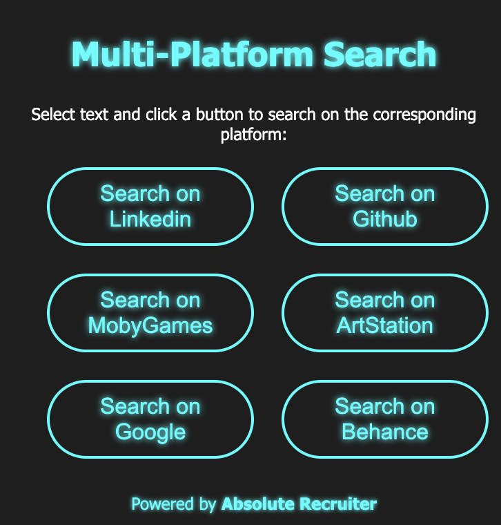

# Multi-Platform Search Extension 🔍

[](https://github.com/carlopezzuto/multi-platform-search-extension)
[](LICENSE)
[](https://developer.chrome.com/docs/extensions/)
[](https://github.com/carlopezzuto/multi-platform-search-extension/actions)

A powerful Chrome extension that lets you search selected text across **13+ platforms** with advanced features like search history, keyboard shortcuts, and customizable settings.



## ✨ Features

### 🌐 **13 Supported Platforms**
- **💼 LinkedIn** - People and professional search
- **🐙 GitHub** - Users and repository search
- **📚 Stack Overflow** - Programming Q&A search
- **🔍 Google** - General web search with operators
- **🐦 Twitter/X** - Tweet and user search
- **👽 Reddit** - Post and subreddit search
- **📺 YouTube** - Video and channel search
- **📝 Medium** - Article and author search
- **🎭 Behance** - Designer and project search
- **🎨 ArtStation** - Artist search
- **🖼️ DeviantArt** - Artist and artwork search
- **🏀 Dribbble** - Designer and shot search
- **🎮 MobyGames** - Game search

### 🚀 **Advanced Features**

#### 📜 Search History
- Automatically saves your last 20 searches
- Quick access dropdown on input focus
- One-click to reuse previous searches
- Clear history option

#### ⌨️ Keyboard Shortcuts
- Press `1-9` to quickly select platforms
- `Enter` to execute search
- `Escape` to close popup
- Can be disabled in settings

#### ⚙️ Customizable Options Page
- **Drag & Drop** - Reorder platforms to match your workflow
- **Enable/Disable** - Hide platforms you don't use
- **Batch Search** - Search multiple platforms at once
- **Settings Export/Import** - Share your configuration
- **Appearance Options** - Customize button layout

#### 🎯 Smart UI/UX
- **Toast Notifications** - Non-intrusive feedback
- **Loading States** - Visual feedback when opening searches
- **Real-time Validation** - Input validation with color indicators
- **Platform-Specific Tips** - Context-sensitive search operator help
- **Right-Click Context Menu** - Search directly from selection

#### 🔒 Security & Performance
- All searches use HTTPS
- Proper error handling for Chrome APIs
- Input sanitization and encoding
- Minimal permissions required

## 📦 Installation

### From Source (Developer Mode)

1. **Download the extension:**
   ```bash
   git clone https://github.com/carlopezzuto/multi-platform-search-extension.git
   cd multi-platform-search-extension
   ```

2. **Install the extension in Chrome:**
   - Open Chrome and navigate to `chrome://extensions/`
   - Enable **Developer mode** (toggle in top right)
   - Click **Load unpacked**
   - Select the project directory

3. **Start using:**
   - The extension icon will appear in your toolbar
   - Pin it for easy access

## 🎯 How to Use

### Method 1: Popup Interface

1. **Select text** on any webpage
2. **Click the extension icon** in the toolbar
3. **Choose a platform** button (or press 1-9)
4. Search opens in a new tab

### Method 2: Context Menu

1. **Select text** on any webpage
2. **Right-click** the selection
3. **Choose** "Search on [Platform]" from the context menu
4. Search opens immediately

### Method 3: Manual Search

1. **Click the extension icon**
2. **Type your query** in the search box
3. **Select a platform** or use keyboard shortcuts
4. **Press Enter** or click Search button

## ⚙️ Configuration

### Access Options Page

- Click the extension icon → Right-click → "Options"
- Or visit `chrome://extensions/` → Extension details → "Extension options"

### Available Settings

#### Platform Management
- ✅ Enable/disable individual platforms
- 🔄 Drag and drop to reorder
- 👁️ Show/hide platform icons

#### General Settings
- 🔐 Search history (on/off)
- 📊 Max history entries (5-100)
- ⌨️ Keyboard shortcuts (on/off)
- 🚪 Close popup after search

#### Batch Search
- 🔀 Search multiple platforms at once
- 📑 Open in separate tabs or new window

#### Import/Export
- 💾 Export settings as JSON
- 📥 Import settings from file
- 🔄 Reset to defaults

## 🛠️ Customization

### Adding a New Platform

It's incredibly easy! Just three steps:

#### 1. Update `urls.js`

Add your platform to `PLATFORM_CONFIG`:

```javascript
const PLATFORM_CONFIG = {
  // ... existing platforms
  Netflix: {
    url: 'https://www.netflix.com/search?q=',
    tips: `<strong>Netflix Search Tips:</strong><br>
      - Use quotes for exact titles<br>
      - Combine genre and actor names`,
    icon: '🎬'
  }
};
```

#### 2. Update `popup.html`

Add a button:

```html
<button id="searchNetflix">🎬 Netflix</button>
```

#### 3. Done!

That's it! The extension automatically:
- Creates event listeners
- Adds context menu items
- Includes it in settings

No manual JavaScript changes needed! 🎉

## 🧪 Development

### Prerequisites

- Node.js 18.x or higher
- npm 9.x or higher
- Chrome browser

### Setup Development Environment

```bash
# Clone the repository
git clone https://github.com/carlopezzuto/multi-platform-search-extension.git
cd multi-platform-search-extension

# Install dependencies
npm install

# Install Playwright browsers for E2E testing
npm run playwright:install

# Run unit tests
npm test

# Run E2E tests
npm run test:e2e

# Run all tests (unit + E2E)
npm run test:all

# Check code quality
npm run lint

# Format code
npm run format
```

### Running Tests

#### Unit Tests (Jest)

```bash
# Run all unit tests
npm test

# Run with coverage
npm run test:coverage

# Run in watch mode
npm run test:watch
```

Current test coverage: **90%+** with 150+ test cases

#### E2E Tests (Playwright)

**Note:** Chrome extension E2E tests require a display. On Linux servers without a display, use `xvfb`:

```bash
# Install Playwright browsers (first time only)
npm run playwright:install

# Run all E2E tests (Linux without display)
xvfb-run --auto-servernum npm run test:e2e

# Run all E2E tests (with display)
npm run test:e2e

# Run E2E tests in UI mode (interactive)
npm run test:e2e:ui

# Run E2E tests in headed mode (see browser)
npm run test:e2e:headed

# Run E2E tests in debug mode
npm run test:e2e:debug

# Run all tests (unit + E2E)
npm run test:all
```

E2E tests cover:
- Extension popup functionality (26 test cases)
- Platform button clicks and search execution
- Search form submission
- Keyboard shortcuts (1-9, Enter, Escape)
- Search history dropdown
- Options page drag-and-drop
- Settings persistence
- Input validation and toast notifications

### Code Quality

```bash
# Lint code
npm run lint

# Auto-fix linting issues
npm run lint:fix

# Check formatting
npm run format:check

# Format all files
npm run format
```

### Project Structure

```
multi-platform-search-extension/
├── .github/
│   └── workflows/
│       └── ci.yml              # CI/CD pipeline
├── tests/
│   └── e2e/
│       ├── popup.spec.js       # Playwright E2E tests for popup
│       └── options.spec.js     # Playwright E2E tests for options
├── manifest.json               # Extension manifest (Manifest V3)
├── popup.html                  # Popup UI structure
├── popup.css                   # Popup styles
├── popup.js                    # Popup logic & event handlers
├── background.js               # Background service worker
├── urls.js                     # Platform configuration (single source of truth)
├── options.html                # Settings page UI
├── options.css                 # Settings page styles
├── options.js                  # Settings page logic
├── popup.test.js               # Jest unit test suite
├── playwright.config.js        # Playwright E2E configuration
├── package.json                # NPM configuration
├── .eslintrc.json              # ESLint configuration
├── .prettierrc.json            # Prettier configuration
├── CONTRIBUTING.md             # Contribution guidelines
├── CHANGELOG.md                # Version history
└── README.md                   # This file
```

## 📖 Platform-Specific Search Tips

### LinkedIn
- `AND` - Include both terms (e.g., *Developer AND Manager*)
- `OR` - Include either term (e.g., *Developer OR Designer*)
- `NOT` - Exclude a term (e.g., *Developer NOT Designer*)

### GitHub
- `user:username` - Search specific users
- `language:python` - Filter by language
- `location:Iceland` - Find users by location
- `in:login` - Search usernames

### Stack Overflow
- `[tag]` - Search within tags
- `is:question` - Only questions
- `score:5` - Minimum score

### Google
- `AND`, `OR`, `NOT` - Boolean operators
- `"exact phrase"` - Exact match
- `-exclude` - Exclude word
- `AROUND(3)` - Proximity search

### Twitter/X
- `from:username` - Tweets from user
- `#hashtag` - Search hashtags
- `filter:verified` - Only verified accounts
- `lang:en` - Filter by language

### Reddit
- `subreddit:name` - Search in subreddit
- `author:username` - Posts by user
- `title:text` - Search titles only

### YouTube
- `channel:name` - Search in channel
- `intitle:text` - Search in titles
- `-word` - Exclude word

## 🤝 Contributing

We welcome contributions! Please see [CONTRIBUTING.md](CONTRIBUTING.md) for guidelines.

### Quick Start for Contributors

1. Fork the repository
2. Create a feature branch (`git checkout -b feature/amazing-feature`)
3. Make your changes
4. Run tests (`npm test`)
5. Commit your changes (`git commit -m 'feat: Add amazing feature'`)
6. Push to the branch (`git push origin feature/amazing-feature`)
7. Open a Pull Request

## 📝 Changelog

See [CHANGELOG.md](CHANGELOG.md) for a detailed version history.

### Recent Updates (v2.0.0)

- ✅ Added 7 new platforms (13 total!)
- ✅ Search history with dropdown
- ✅ Keyboard shortcuts (1-9)
- ✅ Options page with drag-and-drop
- ✅ Toast notifications
- ✅ Loading states
- ✅ ESLint + Prettier
- ✅ 150+ test cases
- ✅ CI/CD pipeline
- ✅ Full JSDoc documentation

## 📊 Statistics

- **Platforms**: 13
- **Test Coverage**: 90%+
- **Test Cases**: 150+
- **Lines of Code**: 2,000+
- **Version**: 2.0.0

## 🐛 Known Issues

None currently! 🎉

Report issues on [GitHub Issues](https://github.com/carlopezzuto/multi-platform-search-extension/issues)

## 🗺️ Roadmap

### v2.1 (Planned)
- [ ] Internationalization (i18n)
- [ ] Advanced search builder UI
- [ ] Search templates
- [ ] Dark/light theme toggle

### v2.2 (Planned)
- [ ] Sync settings across devices
- [ ] Custom platforms (user-defined URLs)
- [ ] Firefox & Edge support

### Future Ideas
- [ ] Search analytics dashboard
- [ ] AI-powered search suggestions
- [ ] Team collaboration features

## ❓ FAQ

**Q: Does this extension collect my data?**
A: No! All searches are performed directly on the platform websites. We don't track or store any personal information.

**Q: Why does it need storage permission?**
A: Only for the optional search history feature. You can disable history in settings.

**Q: Can I add my own custom platforms?**
A: Yes! See the [Customization](#customization) section. Custom UI for this is planned for v2.2.

**Q: Does it work on Firefox?**
A: Not yet, but Firefox support is planned for v2.2.

**Q: How do I disable keyboard shortcuts?**
A: Go to Options → General Settings → Uncheck "Enable keyboard shortcuts"

## 📄 License

This project is licensed under the MIT License - see the [LICENSE](LICENSE) file for details.

Copyright (c) 2023 Enrico Heidelberg

## 👨‍💻 Authors

- **Enrico Heidelberg** - Original author and creator
- **Claude (Anthropic)** - v2.0 comprehensive enhancements

## 🙏 Acknowledgments

- Built with Chrome Extension Manifest V3
- Tested with Jest
- Code quality with ESLint and Prettier
- Icons from emoji set
- Created initially with the help of GPT-4
- Enhanced comprehensively with Claude

## 📞 Support

- 📧 Email: [support@absoluterecruiter.com](mailto:support@absoluterecruiter.com)
- 🐛 Issues: [GitHub Issues](https://github.com/carlopezzuto/multi-platform-search-extension/issues)
- 💬 Discussions: [GitHub Discussions](https://github.com/carlopezzuto/multi-platform-search-extension/discussions)

## ⭐ Show Your Support

If you find this extension useful, please consider:
- ⭐ Starring the repository
- 🐛 Reporting bugs
- 💡 Suggesting new features
- 🤝 Contributing code
- 📢 Sharing with others

---

**Made with ❤️ for developers, recruiters, and power users**

*Search smarter, not harder* 🚀
